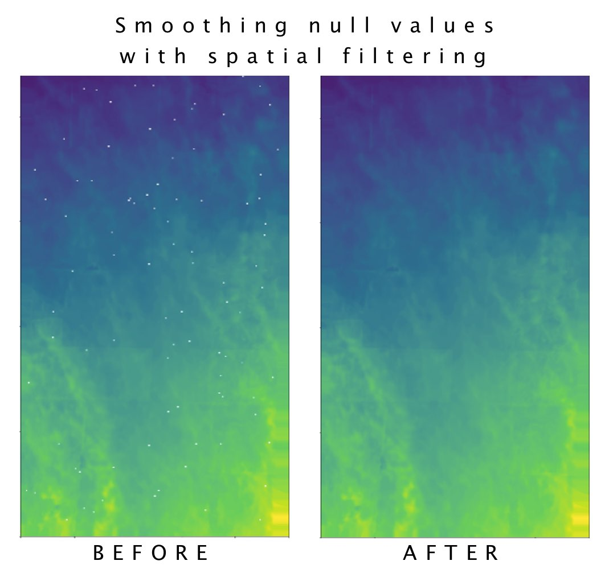

# Spatial Filtering
How to eliminate null values from a GIS dataset using a spatial filter.

>Here you can find the full article *[Managing null values in raster data with Python](https://towardsdatascience.com/managing-null-values-in-raster-data-with-python-511339b1b31b)*, which accompanies this notebook, published on **Towards Data Science** (**Medium**). 



## Installation of dependecies

Create environment:

```python3 -m venv ./venv```

Activate environment:

```source ./venv/bin/activate```

Install dependencies:

```pip install -r requirements.txt```

#### __Further Reading__

* “[Geoprocessing with Python](https://livebook.manning.com/book/geoprocessing-with-python/chapter-11/77)" by Chris Garrard
